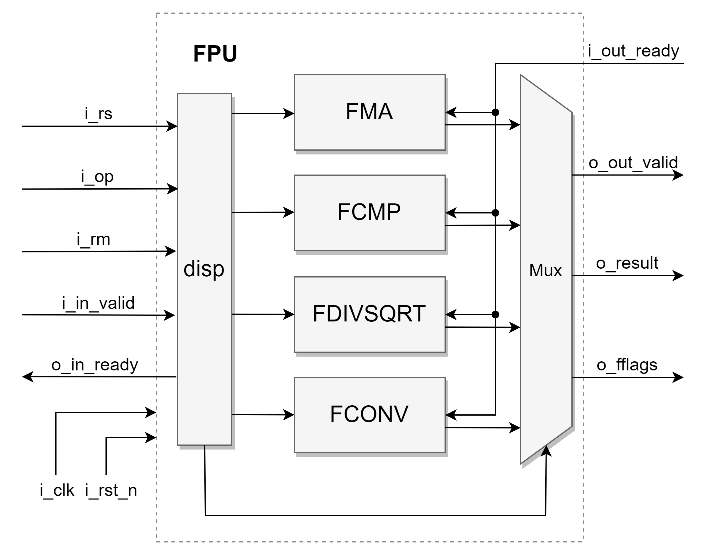
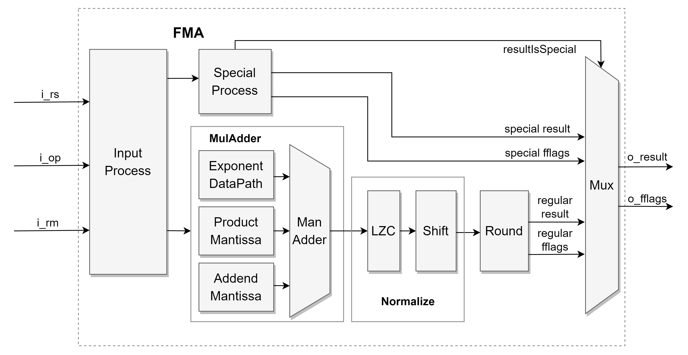
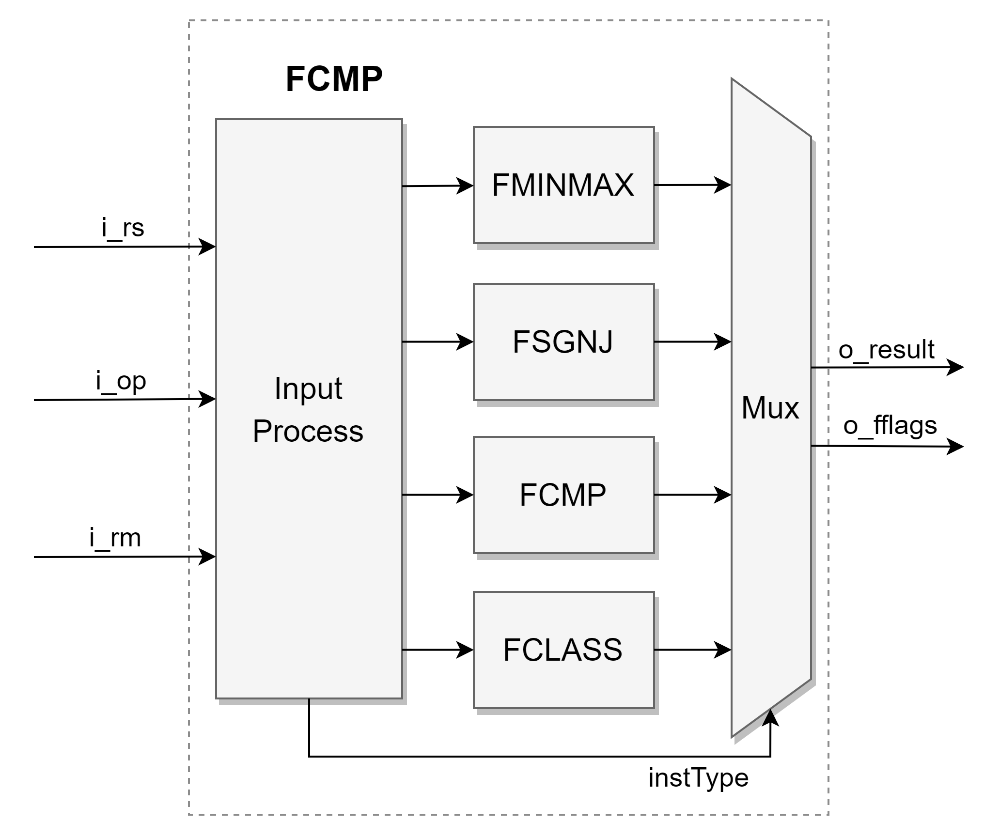
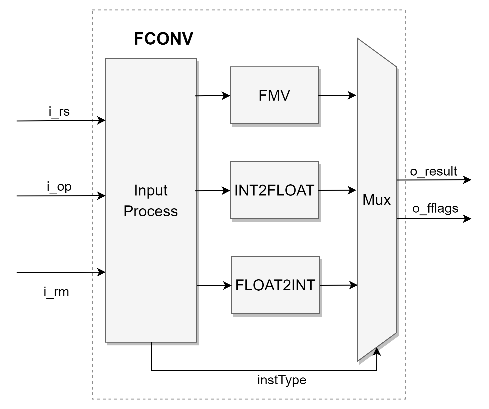
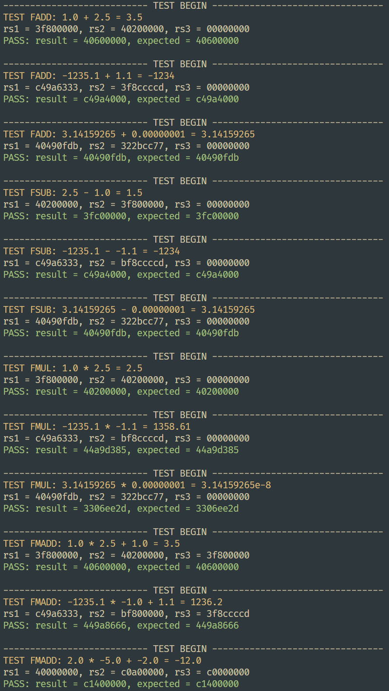
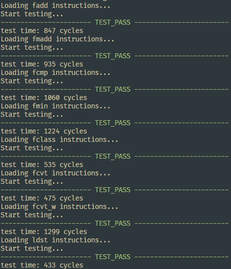

# chms_fpu

本浮点单元符合 IEEE 754 浮点算术标准，支持 RVF 单精度浮点指令集。

## FileList

| Module           | Function                                                     |
| :--------------- | ------------------------------------------------------------ |
| fpu_top          | FPU 顶层模块                                                 |
| fpu_pkg          | sv package，包含数据结构、宏定义等。                         |
| fpu_fma          | 浮点乘加单元                                                 |
| fpu_fcmp         | 浮点比较单元                                                 |
| fpu_fconv        | 浮点转换单元                                                 |
| fpu_fdivsqrt     | 浮点除开方单元（考虑到使用频率与面积占用，未实现除法、开方） |
| fpu_utils_rsinfo | 操作数信息译码模块                                           |
| fpu_utils_shift  | 桶形移位模块                                                 |
| fpu_utils_lzc    | 前导零计数模块                                               |
| fpu_utils_round  | 舍入模块                                                     |

## 顶层模块 fpu_top

| Port Name     | Direction | Type                     | Description                                |
| ------------- | --------- | ------------------------ | ------------------------------------------ |
| `i_clk`       | in        | `logic`                  | 时钟信号                                   |
| `i_rst_n`     | in        | `logic`                  | 异步复位信号                               |
| `i_rs`        | in        | `logic [3:1][FLEN-1:0]`  | 输入 3 个操作数                            |
| `i_op`        | in        | `logic [FPU_OP_NUM-1:0]` | 操作类型                                   |
| `i_operation` | in        | `logic [1:0]`            | 操作类型（来自 ZeroCore）                  |
| `i_rm_inst`   | in        | `logic [2:0]`            | 编码在指令中的 `rm` 位域，静态舍入模式     |
| `i_rm_fcsr`   | in        | `logic [2:0]`            | 保存在 `fcsr` 中的 `rm` 位域，动态舍入模式 |
| `i_in_valid`  | in        | `logic`                  | 输入端握手信号 valid                       |
| `o_in_ready`  | out       | `logic`                  | 输入端握手信号 ready                       |
| `o_result`    | out       | `logic [FLEN-1:0]`       | 计算结果                                   |
| `o_fflags`    | out       | `logic [4:0]`            | 异常标志                                   |
| `o_out_valid` | out       | `logic`                  | 输出端握手信号 valid                       |
| `i_out_ready` | in        | `logic`                  | 输出端握手信号 ready                       |

### 1 浮点乘加单元 fpu_fma

- fpu_fma 执行 `FMADD FMSUB FNMSUB FNMADD FADD FSUB FMUL` 7 条指令。
- fpu_fma 采用加法器、乘法器合并结构，面积占用小，同时避免乘加法器分离导致的融合乘加指令丢失中间精度。缺点是合并结构使得单独的加法与乘法指令延时与融合乘加指令相同。
- `Input Process` 对输入操作数进行变换，以实现不同的计算（如将 `rs3` 变换为 0 以实现乘法 `rs1 * rs2 + 0` ），同时译码出输入操作数信息供后面使用。
- `MulAdder` 中，`Exponent DataPath` 计算 `max(exp1 + exp2, exp3)` 和 `delta(exp)` `shift amount`  以供移位，`Product Mantissa` 计算 `man1 * man2` ，`Addend Mantissa` 根据 `shift amount` 对 `man3` 进行移位，`Man Adder` 计算最终的尾数。
- `Normalize` 中，`LZC` 计算尾数中前导零个数，`Shift` 根据前导零个数进行移位。
- `Round` 中，对尾数进行舍入处理。
- `Special Process` 中，处理特殊情况（如 `inf * rs2 + rs3` ），可快速从旁路得出结果。
- `Mux` 对结果进行选择输出。

### 2 浮点比较单元 fpu_fcmp

- fpu_fcmp 执行 `FLE FLT FEQ FMIN FMAX FSGNJ FSGNJN FSGNJX FCLASS` 9 条指令。
- `FLE FLT FEQ FMIN FMAX` 比较输入操作数的大小。
- `FSGNJ FSGNJN FSGNJX` 根据输入操作数，为 `rs1` 注入不同的符号位。
- `FCLASS` 对输入操作数进行分类，如规格数、非规格数、NaN等

### 3 浮点转换单元 fpu_fconv

- fpu_fconv 执行 `FMVXW FMVWX FCVTSW FCVTSWU FCVTWS FCVTWUS` 6 条指令。
- `FMV` 将整数/浮点寄存器中的 32 位数据搬迁到浮点/整数寄存器中。
- `FCVT` 进行整数/浮点数之间的转换。

### 4 浮点除开方单元 fpu_fdivsqrt

- fpu_fdivsqrt 执行 `FDIV FSQRT` 两条指令。
- 考虑到使用频率与面积占用，未实现除法、开方。
- 可在 gcc 编译参数中加入 `-mno-fdiv` 单独禁用这两条指令，而不影响其他浮点指令。

## 验证

- Testbench

- rv32uf_test

